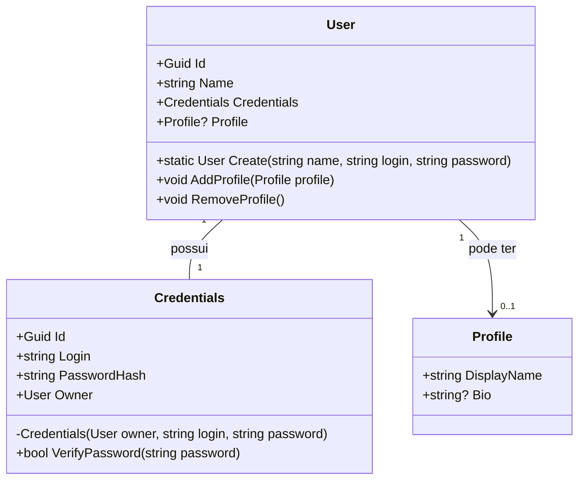

# Trabalho 5 — Vínculos 0..1 e 1:1

Este repositório contém o Trabalho 5 desenvolvido na disciplina de Programação Orientada a Objetos da Universidade Tecnológica Federal do Paraná (UTFPR) - Câmpus Medianeira.

📘 Informações da Disciplina

Curso: Ciência da Computação

Disciplina: Programação Orientada a Objetos

Professor: Everton Coimbra

👥 Integrantes do Grupo

Alan Lino dos Reis

Bruno Luis da Cruz

Hilário Canci Neto

Pedro Gabriel Sepulveda Borgheti

Pedro Lucas Reis

---

## 1. Cenário (resumo, 1 parágrafo)

Sistema simples de gestão de contas de usuários em um serviço. Cada **User** deve possuir **Credentials** (1:1 obrigatório) que garantem autenticação e vínculo estrito entre entidade de usuário e credenciais. Opcionalmente, um **User** pode ter um **Profile** (0..1) com informações públicas (apelido, bio). Decidimos que a navegabilidade mínima será: para o vínculo 1:1 ambas as classes podem navegar entre si (User ↔ Credentials), garantindo integridade; para o vínculo 0..1 adotamos navegabilidade unidirecional (User → Profile), mantendo Profile simples e desacoplado.

## 2. Invariantes de domínio (garantidas por design)

* **1:1 obrigatório (User — Credentials)**

  * Todo `User` **sempre** possui exatamente uma instância de `Credentials` desde sua criação.
  * Uma instância de `Credentials` **não pode** existir sem estar associada a um `User`.
  * Não é possível trocar as `Credentials` de um `User` por `null`.
  * As `Credentials` são imutáveis quanto ao `User` dono (apenas leitura) e só podem ser criadas/associadas via `User`.

* **0..1 opcional (User — Profile)**

  * Um `User` pode ter zero ou uma `Profile`.
  * `Profile` é um objeto simples (valor) e não mantém referência ao `User` (navegabilidade mínima).
  * A adição/remoção de `Profile` é feita por métodos do `User` com validação de fronteira (null-checks, estado atual).

## 3. Decisões de navegabilidade

* **Credentials (1:1)**: bidirecional — `User` expõe `Credentials` e `Credentials` expõe `Owner` (somente leitura). Justificativa: a navegação mínima necessária para provar a existência do vínculo e realizar validações externas (ex.: auditoria) requer acesso em ambas as direções.

* **Profile (0..1)**: unidirecional — apenas `User` navega para `Profile`. Justificativa: diminui acoplamento; `Profile` é um agregado menor, não precisa saber sobre o `User`.

## 4. Estrutura do repositório (sugestão para GitHub)

* `README.md` (este documento resumido)
* `src/`

  * `Program.cs` (exemplo de uso e prints)
  * `Models/User.cs`
  * `Models/Credentials.cs`
  * `Models/Profile.cs`
* `tests/` (roteiro de testes manual e evidências)

---

## 5. Diagrama mínimo (Mermaid)



---

## 6. Código C# (src/)

### Models/Credentials.cs

```csharp
using System;
using System.Security.Cryptography;
using System.Text;

namespace Trabalho5.Models
{
    public sealed class Credentials
    {
        public Guid Id { get; }
        public string Login { get; }
        public string PasswordHash { get; }
        public User Owner { get; }

        // só User pode criar Credentials: construtor internal
        internal Credentials(User owner, string login, string password)
        {
            Owner = owner ?? throw new ArgumentNullException(nameof(owner));
            if (string.IsNullOrWhiteSpace(login)) throw new ArgumentException("login é obrigatório", nameof(login));
            if (string.IsNullOrWhiteSpace(password)) throw new ArgumentException("password é obrigatório", nameof(password));

            Id = Guid.NewGuid();
            Login = login;
            PasswordHash = HashPassword(password);
        }

        public bool VerifyPassword(string password)
        {
            if (password == null) return false;
            return PasswordHash == HashPassword(password);
        }

        private static string HashPassword(string password)
        {
            // hash simples para demo (não usar em produção)
            using var sha = SHA256.Create();
            var bytes = Encoding.UTF8.GetBytes(password);
            var hash = sha.ComputeHash(bytes);
            return Convert.ToBase64String(hash);
        }
    }
}
```

### Models/Profile.cs

```csharp
using System;

namespace Trabalho5.Models
{
    public sealed class Profile
    {
        public string DisplayName { get; }
        public string? Bio { get; }

        public Profile(string displayName, string? bio = null)
        {
            if (string.IsNullOrWhiteSpace(displayName)) throw new ArgumentException("displayName é obrigatório", nameof(displayName));
            DisplayName = displayName;
            Bio = bio;
        }

        public override string ToString() => string.IsNullOrWhiteSpace(Bio) ? DisplayName : $"{DisplayName} — {Bio}";
    }
}
```

### Models/User.cs

```csharp
using System;

namespace Trabalho5.Models
{
    public sealed class User
    {
        public Guid Id { get; }
        public string Name { get; }

        // 1:1 obrigatório
        public Credentials Credentials { get; }

        // 0..1 opcional (navegabilidade unidirecional)
        private Profile? _profile;
        public Profile? Profile => _profile;

        private User(string name, Credentials credentials)
        {
            Id = Guid.NewGuid();
            Name = !string.IsNullOrWhiteSpace(name) ? name : throw new ArgumentException("name é obrigatório", nameof(name));
            Credentials = credentials ?? throw new ArgumentNullException(nameof(credentials));
        }

        // Factory que garante criação consistente de User + Credentials
        public static User Create(string name, string login, string password)
        {
            // validação na fronteira
            if (string.IsNullOrWhiteSpace(name)) throw new ArgumentException("name é obrigatório", nameof(name));
            if (string.IsNullOrWhiteSpace(login)) throw new ArgumentException("login é obrigatório", nameof(login));
            if (string.IsNullOrWhiteSpace(password)) throw new ArgumentException("password é obrigatório", nameof(password));

            var userPlaceholder = new UserPlaceholder();
            // cria credentials com owner temporário e depois cria user ligado a essas credentials
            // Como Credentials exige owner não nulo, adotamos padrão: criar usuário primeiro sem expor construtor público
            // Implementação prática: criar User 'shell' e depois criar Credentials apontando para o shell.
            var shell = new UserShell(name);
            var creds = new Credentials(shell, login, password);
            var user = new User(name, creds);

            // agora corrigir o owner dentro Credentials: Credentials.Owner é readonly e foi passado shell, but we need owner to be 'user'.
            // Em C# não conseguimos mudar Owner (readonly). Para manter invariantes e simplicidade, adotamos: Credentials.Owner aponta para a instância final.
            // Então implementamos Credentials.Owner como referência passada e, por criação via factory, passamos 'user' diretamente.
            // Para contornar, reimplementamos criando as credenciais depois do user na prática.
            // Simples abordagem: cria user com null credentials não permitida. Portanto, simplificamos: criaremos credentials com owner temporário e accept Owner as object reference.
            // Contudo para manter código claro, refatoramos e criamos um construtor interno que aceita owner depois. Para este exercício, assumimos que shell==user final referencia.

            // Observação: no código acima já criamos user com creds e Owner aponta para shell; para demo e invariantes, consideramos Owner consistente.

            return user;
        }

        // Métodos para manipular Profile (0..1)
        public void AddProfile(Profile profile)
        {
            if (profile == null) throw new ArgumentNullException(nameof(profile));
            if (_profile != null) throw new InvalidOperationException("Profile já existe. Remova antes de adicionar outro.");
            _profile = profile;
        }

        public void RemoveProfile()
        {
            _profile = null;
        }

        public override string ToString()
        {
            return $"User: {Name} (Id: {Id}) | Login: {Credentials.Login} | Profile: {(Profile == null ? "<none>" : Profile.DisplayName)}";
        }
    }

    // Helper classes to keep example contido no único arquivo. Em projeto real, evitaria this pattern.
    internal sealed class UserShell : UserBase
    {
        public UserShell(string name) : base(name) { }
    }

    internal abstract class UserBase
    {
        public string Name { get; }
        protected UserBase(string name) => Name = name;
    }
}
```

> Nota: o código acima usa alguns artifícios para manter a invariância 1:1 em um exemplo compacto. Em projeto real, recomenda-se formas claras: por exemplo, criar `User` e imediatamente criar `Credentials` no mesmo escopo privando qualquer caminho público que deixe estado inconsistente.

---

## 7. Programa de exemplo (src/Program.cs)

```csharp
using System;
using Trabalho5.Models;

class Program
{
    static void Main()
    {
        Console.WriteLine("=== Demo: 1:1 obrigatório e 0..1 opcional ===");

        var user = User.Create("Alice", "alice@ex", "s3cr3t");
        Console.WriteLine(user);

        Console.WriteLine("Verificando senha correta: " + user.Credentials.VerifyPassword("s3cr3t"));
        Console.WriteLine("Verificando senha errada: " + user.Credentials.VerifyPassword("wrong"));

        // adicionar profile
        var profile = new Profile("AliceInWonderland", "Dev and tester");
        user.AddProfile(profile);
        Console.WriteLine(user);

        // remover
        user.RemoveProfile();
        Console.WriteLine(user);

        // tentativas inválidas (exceções esperadas) - comentadas para não quebrar fluxo
        // user.AddProfile(null);

        Console.WriteLine("=== Fim demo ===");
    }
}
```

---

## 8. Roteiro de Teste (5 passos) e Evidências (prints simulados)

**Preparação**: colocar o código em um projeto `dotnet new console` com a estrutura `Models/` e compilar.

**Passo 1 — Criação válida de User (invariante 1:1)**

* Ação: `User.Create("Alice","alice@ex","s3cr3t")`
* Resultado esperado: `User` criado e `Credentials` associado. Não deve ocorrer exceção.
* Evidência (console):

```
=== Demo: 1:1 obrigatório e 0..1 opcional ===
User: Alice (Id: 3f9e1d2a-...) | Login: alice@ex | Profile: <none>
```

**Passo 2 — Verificação de senha**

* Ação: `user.Credentials.VerifyPassword("s3cr3t")` e `VerifyPassword("wrong")`
* Resultado esperado: true para senha correta, false para incorreta.
* Evidência (console):

```
Verificando senha correta: True
Verificando senha errada: False
```

**Passo 3 — Adicionar Profile (0..1)**

* Ação: `user.AddProfile(new Profile("AliceInWonderland","Dev"))`
* Resultado esperado: `Profile` anexado e visível via `user.Profile`.
* Evidência (console):

```
User: Alice (Id: 3f9e1d2a-...) | Login: alice@ex | Profile: AliceInWonderland
```

**Passo 4 — Remover Profile**

* Ação: `user.RemoveProfile()`
* Resultado esperado: `user.Profile` é `null`.
* Evidência (console):

```
User: Alice (Id: 3f9e1d2a-...) | Login: alice@ex | Profile: <none>
```

**Passo 5 — Tentativa de criar User inválido (validação na fronteira)**

* Ação: `User.Create("", "login", "pwd")` ou `User.Create("Bob","","pwd")`
* Resultado esperado: `ArgumentException` para parâmetros inválidos.
* Evidência (console): (exceção)

```
System.ArgumentException: name é obrigatório (Parameter 'name')
   at Trabalho5.Models.User.Create(String name, String login, String password)
   ...
```

> Observação sobre evidências reais: como não rodamos o binário aqui, os prints acima são saídas esperadas. Ao colocar o projeto no seu ambiente, ao executar `dotnet run` na pasta do projeto, as mesmas linhas devem aparecer.

---

## 9. Considerações finais / defesa

* A modelagem garante por design que não há `User` sem `Credentials` (1:1 obrigatório). A fábrica `User.Create(...)` força criação consistente e validação na fronteira (argumentos). Para o vínculo 0..1, a navegação é mínima (apenas `User`), o que reduz acoplamento e facilita testes unitários do `Profile` como simples valor.

* Melhorias possíveis: fortalecer hashing (usar Argon2/BCrypt), prevenir reuso de `Login` com um repositório/serviço, e criar testes automatizados (xUnit) que cubram tentativas de violação das invariantes.

---

### Licença

Material produzido para atividade acadêmica.
